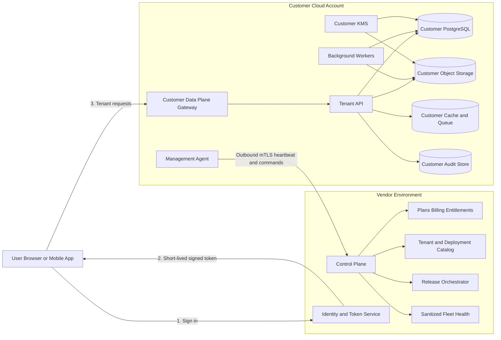
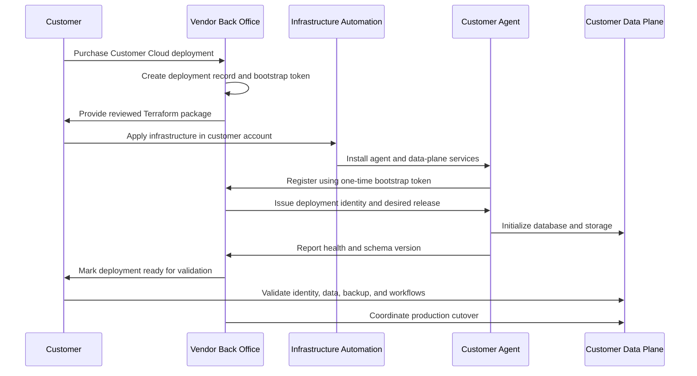
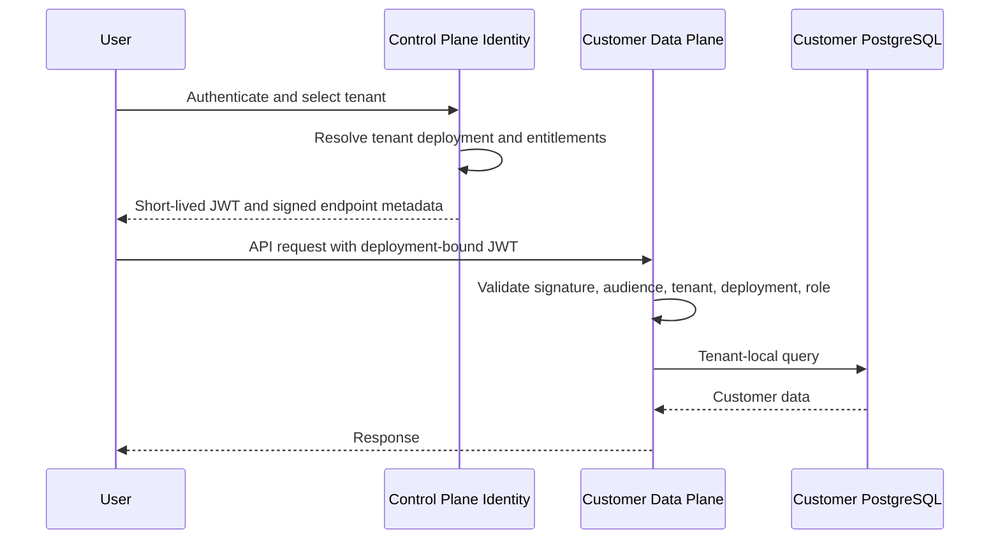

# Customer-Managed Database and BYOC Data Plane

**Document type:** Reusable product and architecture specification  
**Prepared:** 17 September 2026  
**Primary application:** MatrixHR  
**Reusable for:** Multi-tenant SaaS products that need customer-owned data infrastructure

---

## 1. Purpose

This document defines how a SaaS product can let a customer own and host its operational database and sensitive business data while the software vendor continues to operate the commercial control plane, product releases, tenant registration, entitlements, and service management.

The requested business model is:

- The vendor operates the main platform and back office.
- The vendor creates or registers the customer tenant.
- The vendor manages plans, subscriptions, entitlements, releases, and support.
- The client owns the environment where its business and user data is stored.
- The client may host its own PostgreSQL database or an entire application data plane.
- The vendor product remains usable as a managed service rather than becoming an unmanaged software package.

This capability is possible. The recommended product name is **Customer Cloud** or **Customer-Managed Data Plane**. The technical market term is commonly **Bring Your Own Cloud (BYOC)**.

---

## 2. Executive Decision

### 2.1 Recommended offer

Build a split **control plane and data plane** architecture.

- The vendor control plane remains centrally hosted.
- Sensitive customer records are stored in an isolated customer data plane.
- For the strongest customer-ownership offer, the data plane runs inside the customer's cloud account.
- The customer owns the database, object storage, encryption keys, backups, and network boundary.
- The vendor manages the application software through a narrowly scoped management agent and signed release process.
- Runtime access to the customer database stays inside the customer environment.
- The management connection is initiated outbound from the customer environment.

### 2.2 Do not make remote database-only connectivity the primary architecture

A central shared API can technically connect to separate client-hosted databases. This may be acceptable for a controlled pilot, but it should not become the long-term enterprise architecture.

Direct remote database connectivity causes:

- High latency between API and database.
- Firewall and allowlist work for every client.
- Long-lived external database credentials.
- Large numbers of independent connection pools.
- Customer network failures affecting application requests.
- Difficult upgrades and migrations.
- Inconsistent database versions and settings.
- An incomplete data boundary because files, queues, caches, and logs remain elsewhere.

The recommended BYOC design places the application data API, background workers, database, cache, and file storage in the customer's environment.

### 2.3 Recommended sequence

1. Build the vendor control plane and entitlements.
2. Split control-plane data from tenant business data.
3. Support a vendor-hosted dedicated database per tenant.
4. Automate provisioning, routing, migrations, monitoring, and recovery.
5. Move the same standardized data-plane package into a customer-owned cloud account.
6. Consider full self-hosting only after managed BYOC is stable.

This sequence produces reusable operational capability at each stage instead of attempting the hardest model first.

---

## 3. Terminology

### 3.1 Control plane

The vendor-operated services that manage:

- Tenants and organizations.
- Plans and subscriptions.
- Entitlements and usage limits.
- Deployment registration and routing.
- Release assignment.
- Health and version metadata.
- Billing and commercial operations.
- Support authorization.
- Minimal login and identity routing where required.

The control plane must not silently become a second copy of customer business data.

### 3.2 Data plane

The services that process and store the customer's operational data:

- Product API endpoints.
- Background workers.
- PostgreSQL database.
- Object/file storage.
- Redis or equivalent cache and queue state.
- Search indexes.
- Customer activity audit logs.
- Generated reports and exports.

### 3.3 Customer-managed database

The customer owns and controls the database infrastructure. The application may be vendor-hosted or may run beside the database in the customer's environment.

### 3.4 BYOC

The vendor deploys and manages its software inside the customer's cloud account, VPC, VNet, project, or subscription. The customer retains infrastructure ownership and pays the cloud provider.

### 3.5 Private SaaS

A dedicated application stack is operated for one customer. The stack may be vendor-owned or customer-owned.

### 3.6 Self-hosted

The customer operates the application, database, upgrades, monitoring, security, backups, and recovery. Vendor involvement is normally limited to software distribution and contracted support.

### 3.7 Data residency

Data is stored and processed in a specified country or region. Residency does not imply that the customer owns the infrastructure.

### 3.8 BYOK and customer-managed keys

The customer controls the encryption key used to protect data at rest. Key ownership alone does not imply database or cloud-account ownership.

---

## 4. Market Deployment Models

Cloud architecture guidance commonly describes three tenant-isolation patterns:

| Model | Storage | Isolation | Cost | Operational complexity |
|---|---|---:|---:|---:|
| Pool | Shared database and shared tables with tenant keys | Lowest | Lowest | Lowest initially |
| Bridge | Separate schema or database on shared infrastructure | Medium-high | Medium | Medium |
| Silo | Dedicated database or complete infrastructure per tenant | Highest | Highest | Highest |

The models are not mutually exclusive. A SaaS product can use a pool for normal customers, a vendor-hosted silo for premium customers, and a customer-owned silo for regulated enterprise customers.

### 4.1 Standard shared SaaS

The vendor owns the application and a shared database. Tenant IDs partition customer records.

Best for:

- Small and medium customers.
- Low setup cost.
- Fast provisioning.
- Frequent continuous delivery.

Limitations:

- Lower perceived isolation.
- Shared performance limits.
- Harder customer-specific residency or key ownership.
- Greater consequence if application-level tenant scoping fails.

### 4.2 Vendor-hosted dedicated database

The vendor operates one database per customer while sharing the application tier or deploying a dedicated application stamp.

Best for:

- Customers needing stronger isolation.
- Faster enterprise delivery than BYOC.
- A stepping stone toward customer-cloud deployments.

Limitations:

- Vendor still owns infrastructure.
- Higher vendor cost.
- Requires tenant-to-database routing and fleet migrations.

### 4.3 Customer database with vendor-hosted shared application

The vendor's application connects to a database hosted by the customer.

Best for:

- Controlled transition cases.
- A small number of customers with reliable private connectivity.
- Read-heavy products where query latency is acceptable.

Limitations:

- Operationally fragile at scale.
- Requires external connectivity to every database.
- Application still processes data in the vendor environment.
- Files and other stores may remain vendor-owned.

### 4.4 Vendor-managed BYOC data plane

The application services and data stores run in the customer's cloud. A vendor control plane manages deployment metadata, releases, entitlements, health, and support.

Best for:

- Regulated customers.
- Strong data-boundary requirements.
- Customers with cloud-security teams.
- Data sovereignty and customer-key requirements.

Limitations:

- More expensive to build and operate.
- Requires infrastructure automation and strict compatibility.
- Shared responsibility must be documented precisely.

### 4.5 Fully self-managed/on-premises

The customer installs and operates the entire stack.

Best for:

- Air-gapped environments.
- Defense, critical government, or strict internal hosting mandates.
- Customers with a capable operations team.

Limitations:

- Slow adoption of product updates.
- Difficult support and incident reproduction.
- Environment drift.
- High documentation and compatibility burden.
- Risk that the vendor receives blame for customer operational failures.

---

## 5. Product Offerings

The product should expose deployment as a contracted entitlement rather than an informal implementation exception.

| Commercial offer | Data deployment | Operations | Target customer |
|---|---|---|---|
| Cloud Standard | Shared vendor database | Vendor managed | SMB and normal mid-market |
| Cloud Isolated | Dedicated vendor database | Vendor managed | Security-conscious mid-market |
| Customer Cloud | Customer-owned cloud data plane | Vendor managed under limited permissions | Enterprise and regulated buyers |
| Self-Managed | Customer infrastructure | Customer operated | Exceptional on-premises need |

### 5.1 Recommended names

Customer-facing names should be clear and avoid technical ambiguity:

- **MatrixHR Cloud** — normal managed SaaS.
- **MatrixHR Private** — vendor-hosted isolated database or dedicated stamp.
- **MatrixHR Customer Cloud** — vendor-managed software in the customer's cloud.
- **MatrixHR Self-Managed** — customer-operated deployment, if later offered.

### 5.2 Eligibility

Customer Cloud should require:

- Enterprise plan.
- Annual contract.
- One-time onboarding and migration engagement.
- Premium support.
- Supported cloud and managed database service.
- Named customer cloud and security owners.
- Agreement to supported versions and maintenance policy.
- Completed architecture and responsibility review.

---

## 6. Recommended Architecture



### 6.1 Core principle

Sensitive data paths stay inside the customer environment. The control plane receives only contractually permitted metadata.

### 6.2 Data-plane components

The standard data-plane package should include:

- API service.
- Background worker service.
- Management agent.
- PostgreSQL database or connection to an approved managed PostgreSQL service.
- Object storage bucket/container.
- Cache and job queue.
- Audit event storage.
- Monitoring and log forwarding configured to the agreed boundary.
- Ingress gateway or private application endpoint.
- Customer-managed encryption keys where supported.

### 6.3 Deployment stamp

Each customer data plane is a deployment stamp with a stable identity:

- `deploymentId`
- `tenantId`
- environment such as production or staging
- cloud provider and account
- region
- network profile
- application version
- database schema version
- endpoint
- status and health
- release channel

The stamp must not depend on a customer-specific code branch.

---

## 7. Data Boundary

### 7.1 Control-plane data

The vendor control plane can store:

- Tenant commercial name and stable tenant ID.
- Subscription, plan, add-ons, and entitlements.
- Billing account and billing contacts.
- Deployment type, cloud, region, endpoint, and health.
- Current and desired application/schema versions.
- Minimal identity and routing information.
- Signed-in user subject and tenant membership where centrally authenticated.
- Aggregated usage counts.
- Sanitized service metrics.
- Platform administration audit events.
- Customer-approved support access events.

### 7.2 Data-plane data

The customer data plane stores:

- Employee identity and contact data.
- Government identifiers.
- Bank, tax, salary, payroll, and benefits data.
- Attendance, location, leave, and timesheet data.
- Recruitment candidates and resumes.
- Onboarding and offboarding records.
- Performance, feedback, 1:1, survey, and learning data.
- Documents, attachments, generated reports, and exports.
- Customer workflow payloads.
- Customer activity audit history.
- Customer configuration containing sensitive business rules.

### 7.3 Derived data

Derived data must be classified explicitly. Examples include:

- Search indexes.
- AI embeddings.
- Analytics extracts.
- Error payloads.
- Debug traces.
- Notification bodies.
- Webhook payloads.
- Report caches.
- Temporary exports.

These are still customer data. They must not leave the customer boundary merely because they are generated by the application.

### 7.4 Telemetry policy

Allowed telemetry should normally include:

- Service availability.
- CPU, memory, disk, queue depth, and database connection counts.
- Request count and latency without payloads.
- Error codes with customer content removed.
- Application and schema versions.
- Migration state.
- Aggregate licensed usage.

Disallowed by default:

- Employee names or email addresses.
- Request or response bodies.
- SQL parameters containing HR data.
- Document names or content.
- Salary and payroll figures.
- Candidate or performance information.
- Full stack traces containing record values.

---

## 8. Identity and Authentication

### 8.1 Central identity option

The user authenticates with the vendor identity service. The identity service issues a short-lived token containing:

- user subject
- tenant ID
- deployment ID
- role or permission version
- token audience for the selected data plane
- issue and expiry timestamps
- session or device identifier where needed

The customer data plane validates the token locally using the vendor's published signing keys. A normal request should not need to call the control plane.

### 8.2 Federated enterprise identity option

For customers requiring minimal central identity data:

- The customer authenticates through its SAML or OIDC identity provider.
- The control plane stores an opaque external subject and tenant membership.
- Employee profile data remains in the customer data plane.
- SCIM provisioning can target the customer data plane or a narrowly scoped identity directory.

### 8.3 Authorization

Authentication and product entitlements are different controls:

- Identity proves who the user is.
- Tenant membership proves which tenant the user belongs to.
- Customer roles determine which HR records and actions the user can access.
- Commercial entitlements determine which product features the tenant has purchased.

The data plane should cache a signed entitlement document so temporary control-plane unavailability does not stop customer operations.

### 8.4 Token requirements

- Short lifetime.
- Explicit audience.
- Deployment and tenant binding.
- Asymmetric signing.
- Key rotation.
- Clock-skew tolerance.
- Replay resistance for privileged operations where appropriate.
- Immediate session revocation path for high-risk events.

---

## 9. Network Connectivity

### 9.1 Preferred management connectivity

The customer management agent initiates an outbound mutually authenticated TLS connection to the vendor control plane.

Benefits:

- No inbound administrative port from the vendor network.
- Easier customer firewall review.
- The customer can terminate connectivity immediately.
- Short-lived credentials can be rotated automatically.
- Commands and responses can be audited.

### 9.2 User traffic options

Supported patterns may include:

1. Public customer-specific HTTPS endpoint protected by WAF and strong authentication.
2. Customer VPN-only endpoint.
3. PrivateLink/Private Endpoint/Private Service Connect.
4. Customer reverse proxy or application gateway.

The endpoint selected affects mobile access, remote employees, support, certificate ownership, and DNS.

### 9.3 Direct database access

The database should normally be reachable only by data-plane services and approved customer administrators. The vendor control plane should not have a permanent direct database path.

### 9.4 DNS and routing

The tenant deployment catalog maps the tenant to its data-plane endpoint. Supported patterns:

- `customer.matrixhr.example`
- customer-owned custom domain
- tenant-aware application shell loading a deployment endpoint after login

The routing response must be signed or returned through an authenticated control-plane session to prevent endpoint substitution.

---

## 10. Secrets and Encryption

### 10.1 Secrets

Database passwords and infrastructure credentials must not be stored as plaintext fields in the commercial database.

Use:

- Customer cloud secret manager.
- Workload identity or managed identity where possible.
- Short-lived database authentication where available.
- Secret references in the control plane rather than secret values.
- Automated rotation.

### 10.2 Encryption at rest

The customer should control or approve keys for:

- Database storage.
- Object storage.
- Backup vault.
- Persistent disks.
- Search or analytics stores.

### 10.3 Encryption in transit

- TLS for user traffic.
- TLS for database connections.
- mTLS for management agent traffic.
- Private cloud networking where contracted.
- Certificate rotation and expiry monitoring.

### 10.4 Support access

Vendor engineers should not receive standing customer-cloud credentials. Support access should use:

- Customer approval.
- Named support operator.
- Reason and ticket reference.
- Time-limited role assumption.
- Least privilege.
- Session recording or comprehensive command logging where feasible.
- Automatic expiry.
- Customer-visible audit trail.

---

## 11. Provisioning Lifecycle



### 11.1 Qualification

- Confirm why the customer requires database ownership.
- Identify data residency and network requirements.
- Confirm cloud provider, region, database service, and customer skills.
- Determine whether the customer needs dedicated database, BYOC, or full self-hosting.
- Complete security and shared-responsibility review.

### 11.2 Infrastructure preparation

- Create dedicated project/account/subscription or approved resource group.
- Configure network and DNS.
- Configure KMS and secrets.
- Provision managed PostgreSQL.
- Provision object storage and backup vault.
- Configure logs and monitoring.
- Configure the agent's least-privilege identity.

### 11.3 Bootstrap

- Back office creates deployment ID.
- Back office issues a one-time, short-lived bootstrap token.
- Agent redeems the token once.
- Agent receives a unique workload identity and certificates.
- Bootstrap token is permanently invalidated.

### 11.4 Initialization

- Verify database version and required extensions.
- Apply baseline schema.
- Create initial tenant record in the data plane.
- Register object storage.
- Run connectivity and encryption tests.
- Create backup and restore-test schedule.

### 11.5 Migration

- Export source data.
- Validate record counts and checksums.
- Import into customer database.
- Transfer documents to customer object storage.
- Run tenant and authorization validation.
- Run payroll or other financial parallel checks where applicable.
- Freeze writes for final delta transfer.
- Switch tenant routing.
- Retain rollback window according to the migration agreement.

### 11.6 Production acceptance

- Authentication works.
- Entitlements resolve.
- Data-plane health is green.
- Backup succeeds.
- Restore test succeeds.
- Monitoring alerts reach the correct owners.
- Support access remains disabled.
- Customer accepts reconciliation results.

---

## 12. Release and Schema Management

### 12.1 Immutable releases

Each data-plane release should have:

- Semantic application version.
- Container image digest.
- Software bill of materials where required.
- Signature and provenance.
- Compatible schema version range.
- Release notes.
- Migration manifest.
- Rollback instructions.

### 12.2 Release channels

Suggested channels:

- Rapid: frequent updates after automated validation.
- Standard: normal production cadence.
- Controlled: customer-approved maintenance windows.
- Long-term support: a limited set of maintained versions for strict customers.

Do not allow indefinite version pinning. It creates security and compatibility risk.

### 12.3 Schema migrations

Migrations must be:

- Versioned.
- Idempotent where possible.
- Backward-compatible during rolling deployment.
- Tested against supported database versions.
- Observable from the control plane.
- Pausable before destructive steps.
- Recorded in the customer audit trail.

Use an expand-and-contract approach:

1. Add new structures without removing old ones.
2. Deploy application code that can use both versions.
3. Backfill safely.
4. Verify.
5. Remove old structures in a later release.

### 12.4 Customization policy

Do not create customer-specific schema forks. Support customer variation through:

- Custom fields.
- Configuration.
- Workflow definitions.
- Feature flags.
- Versioned extension APIs.
- Approved customer extensions with stable contracts.

---

## 13. Backup, Restore, and Disaster Recovery

### 13.1 Minimum backup standard

- Automated database backups.
- Point-in-time recovery.
- Encrypted backup storage.
- Defined retention.
- Cross-zone resilience.
- Cross-region copy where contracted.
- Object-storage versioning or equivalent protection.
- Configuration backup.

### 13.2 Ownership

Database ownership does not automatically define backup responsibility. The contract must specify:

- Who configures backups.
- Who monitors failures.
- Who pays storage cost.
- Who can initiate restore.
- Who approves production restoration.
- Required recovery point objective.
- Required recovery time objective.

### 13.3 Restore testing

A successful backup job is not proof that recovery works. Perform scheduled restore tests and record:

- Backup identifier.
- Restore environment.
- Start and end time.
- Data validation result.
- Application validation result.
- Observed RPO and RTO.
- Corrective actions.

### 13.4 Disaster scenarios

Test:

- Accidental record deletion.
- Failed schema migration.
- Database service failure.
- Region outage.
- Object-storage corruption or deletion.
- Lost encryption-key access.
- Compromised application credential.
- Control-plane outage.
- Management-agent outage.

The customer data plane should continue core operations during a temporary control-plane outage by using cached identity keys and signed entitlements.

---

## 14. Observability and Support

### 14.1 Local detailed telemetry

Detailed logs and traces containing possible customer data remain in the customer environment.

### 14.2 Central fleet telemetry

The control plane receives only sanitized information:

- Availability.
- Version.
- Migration status.
- Resource saturation.
- Request latency and error counts.
- Queue depth.
- Backup status.
- Certificate expiry.
- Agent heartbeat.

### 14.3 Correlation

Use opaque correlation IDs that allow support to match a customer-visible error with a local trace without exporting the trace payload.

### 14.4 Support workflow

1. Customer opens ticket.
2. Control plane displays sanitized health.
3. Customer can export a redacted diagnostic bundle.
4. If more access is required, customer issues a support grant.
5. Named vendor operator assumes the limited role.
6. Session is audited.
7. Grant expires automatically.
8. Customer receives an access summary.

---

## 15. Security Control Baseline

### 15.1 Tenant and deployment identity

- Every deployment has a cryptographic identity.
- Every token binds tenant and deployment.
- A data plane rejects tokens for another tenant or deployment.
- Deployment registration uses a single-use token.

### 15.2 Least privilege

- Data-plane services use separate service identities.
- Agent permissions are separated from runtime application permissions.
- Database migration permission is separate from normal application permission where possible.
- Support access is separate from automated operations.

### 15.3 Supply-chain security

- Signed images.
- Pinned image digests.
- Vulnerability scanning.
- Dependency inventory and SBOM.
- Controlled build pipeline.
- Admission policy to reject unapproved images.

### 15.4 Network security

- Database on private network.
- No public database endpoint by default.
- Outbound-only management connection.
- Egress allowlists.
- WAF and rate limits for public application endpoints.
- Private connectivity option for strict customers.

### 15.5 Data security

- Encryption in transit and at rest.
- Customer-controlled key option.
- Secret rotation.
- Redaction in logs.
- Export authorization and audit.
- Configurable retention and deletion.
- Secure temporary files.

### 15.6 Administrative security

- MFA for control-plane operators.
- Separate production roles.
- Approval for privileged actions.
- Immutable platform audit log.
- No shared support accounts.
- Regular access review.

---

## 16. Shared Responsibility Model

Use a contract-specific version of this table for each customer.

| Area | Vendor | Customer | Shared detail |
|---|---|---|---|
| Product code | Owns and secures | Reviews requirements | Vendor signs releases |
| Control plane | Operates | Uses | Vendor retains commercial metadata |
| Cloud account | Limited authorized operation | Owns and pays | Customer controls organization policies |
| Network | Supplies requirements | Owns | Joint connectivity testing |
| Data-plane compute | Deploys/operates if managed BYOC | Owns infrastructure | Customer may restrict permissions |
| Database service | Supplies compatibility and monitoring | Owns | Operational tasks assigned by contract |
| Database contents | Processes only as needed | Owns/governs | Customer defines retention |
| Schema | Owns product schema | Must not fork | Migrations coordinated |
| Encryption keys | Integrates | Owns | Recovery process agreed |
| Backups | Monitors if contracted | Owns policy/storage | Restore testing is shared |
| Identity provider | Integrates | Owns IdP | Vendor may operate central token broker |
| User access | Provides controls | Configures and approves | Both audit privileged access |
| Monitoring | Monitors product health | Monitors cloud account | Data boundary controls export |
| Incident response | Leads product incidents | Leads account/network incidents | Joint incident process |
| Compliance evidence | Provides product evidence | Provides infrastructure evidence | Combined customer assessment |
| Decommissioning | Removes vendor access | Retains or deletes data | Both attest completion |

---

## 17. Control-Plane Data Model

The following conceptual entities are reusable across products.

### 17.1 Deployment target

```text
DeploymentTarget
- id
- code: STANDARD | DEDICATED | BYOC | SELF_MANAGED
- name
- enabled
- supportedClouds
- defaultSupportPlan
- defaultReleaseChannel
```

### 17.2 Customer cloud account

```text
CustomerCloudAccount
- id
- tenantId
- provider: AWS | AZURE | GCP | ON_PREM
- externalAccountRef
- region
- ownershipVerifiedAt
- status
- metadataWithoutSecrets
```

### 17.3 Data plane

```text
DataPlane
- id
- tenantId
- deploymentTargetId
- customerCloudAccountId
- environment
- endpoint
- region
- desiredVersion
- currentVersion
- schemaVersion
- releaseChannel
- status
- lastHeartbeatAt
- createdAt
- decommissionedAt
```

### 17.4 Connectivity profile

```text
ConnectivityProfile
- id
- dataPlaneId
- mode: OUTBOUND_AGENT | PRIVATE_LINK | PEERING | VPN | PUBLIC_TLS
- status
- certificateExpiresAt
- allowedDestinations
- lastVerifiedAt
```

### 17.5 Secret reference

```text
SecretReference
- id
- dataPlaneId
- purpose
- provider
- vaultReference
- versionReference
- rotatedAt

Never store the resolved secret value here.
```

### 17.6 Release assignment

```text
ReleaseAssignment
- id
- dataPlaneId
- releaseVersion
- imageDigest
- desiredAt
- maintenanceWindow
- state
- approvedByCustomerAt
- startedAt
- completedAt
- rollbackVersion
```

### 17.7 Migration execution

```text
MigrationExecution
- id
- dataPlaneId
- fromSchemaVersion
- toSchemaVersion
- migrationDigest
- state
- startedAt
- completedAt
- failureCode
- sanitizedFailureDetail
```

### 17.8 Support access grant

```text
SupportAccessGrant
- id
- tenantId
- dataPlaneId
- requestedBy
- approvedByCustomer
- operatorId
- ticketRef
- reason
- permissions
- validFrom
- expiresAt
- revokedAt
- sessionAuditRef
```

### 17.9 Data boundary policy

```text
DataBoundaryPolicy
- id
- dataPlaneId
- telemetryProfile
- permittedMetricKeys
- diagnosticExportMode
- logRetentionLocation
- aiProcessingPolicy
- externalIntegrationPolicy
- approvedAt
```

### 17.10 Backup attestation

```text
BackupAttestation
- id
- dataPlaneId
- policyRef
- lastSuccessfulBackupAt
- lastRestoreTestAt
- observedRpo
- observedRto
- status
- evidenceRef
```

---

## 18. Control-Plane APIs and Events

### 18.1 Agent registration

```http
POST /control/v1/deployments/{deploymentId}/register
Authorization: Bootstrap <single-use-token>
```

Returns:

- workload identity
- certificates or identity bootstrap configuration
- control-plane endpoint
- desired release
- signed entitlement snapshot
- telemetry policy

### 18.2 Heartbeat

```http
POST /control/v1/deployments/{deploymentId}/heartbeat
Authorization: mTLS workload identity
```

Payload contains only sanitized health and version metadata.

### 18.3 Desired state

```http
GET /control/v1/deployments/{deploymentId}/desired-state
```

Returns:

- desired release
- migration manifest reference
- entitlement snapshot version
- configuration version
- maintenance constraint

### 18.4 Usage report

```http
POST /control/v1/deployments/{deploymentId}/usage
```

Use aggregated counts, not individual employee events, unless the commercial model explicitly requires otherwise.

### 18.5 Support grant

```http
POST /control/v1/deployments/{deploymentId}/support-grants
POST /control/v1/support-grants/{grantId}/revoke
```

### 18.6 Events

- `deployment.registered`
- `deployment.healthy`
- `deployment.degraded`
- `deployment.offline`
- `release.assigned`
- `release.started`
- `release.completed`
- `release.failed`
- `migration.started`
- `migration.completed`
- `migration.failed`
- `backup.failed`
- `restore_test.overdue`
- `certificate.expiring`
- `support_access.granted`
- `support_access.revoked`
- `deployment.decommissioned`

---

## 19. Runtime Request Flow



The control plane is not in the normal data-query path after login. This reduces latency and lets the data plane tolerate a temporary control-plane outage.

---

## 20. Failure Handling

### 20.1 Control plane unavailable

- Existing sessions continue for a limited period.
- Data plane uses cached signing keys and entitlements.
- New subscription changes wait.
- Agent retries with exponential backoff.
- Customer operations continue unless a security revocation requires fail-closed behavior.

### 20.2 Customer data plane unavailable

- Control plane marks deployment degraded or offline.
- Customer-facing status identifies the affected tenant only.
- Vendor and customer alerts follow the responsibility matrix.
- Other tenants remain unaffected.

### 20.3 Agent unavailable

- Runtime application can continue.
- Releases and centralized health reporting pause.
- Alert after a defined heartbeat threshold.
- No automatic insecure fallback path.

### 20.4 Migration failure

- Stop rollout.
- Preserve migration logs locally.
- Report sanitized failure code centrally.
- Execute tested rollback or forward-fix procedure.
- Do not mark desired version successful.
- Require customer approval if recovery affects availability or data.

### 20.5 Customer revokes vendor permissions

- Control plane records access loss.
- Runtime continues if local services remain healthy.
- Managed-service SLA pauses or changes according to contract.
- Customer receives remediation guidance.
- No attempt is made to bypass customer controls.

### 20.6 Encryption key unavailable

- Fail safely.
- Alert the customer immediately.
- Avoid destructive automatic recreation.
- Follow documented key-recovery process.

---

## 21. Data Portability and Exit

Customer ownership must include a clear exit path.

### 21.1 Export

- PostgreSQL logical export or approved native backup.
- Object storage inventory and content.
- Schema documentation.
- Audit-log export.
- Configuration export.
- Checksums and record counts.

### 21.2 Decommission

1. Customer requests termination.
2. Commercial access and dates are confirmed.
3. Final export is produced or ownership is transferred.
4. Vendor support access is revoked.
5. Agent identity is revoked.
6. Vendor routing is removed.
7. Customer chooses infrastructure retention or deletion.
8. Vendor deletes permitted control-plane personal data according to retention policy.
9. Both parties receive decommission evidence.

### 21.3 No hostage architecture

Avoid undocumented proprietary transformations that prevent the customer from reading its own database. The application schema can remain proprietary, but exports and data dictionaries should make customer records practically portable.

---

## 22. Commercial Model

### 22.1 Charge components

- Enterprise product subscription.
- One-time BYOC design and provisioning fee.
- Migration fee.
- Annual BYOC management fee.
- Premium support.
- Optional disaster recovery and restore testing.
- Optional controlled release schedule.
- Optional private connectivity implementation.
- Additional fee for unsupported cloud patterns or on-premises work.

### 22.2 Customer-paid infrastructure

The client pays its cloud provider for:

- Database.
- Compute.
- Object storage.
- Backup storage.
- Network egress and private endpoints.
- Monitoring retained in its account.
- Encryption-key operations.

### 22.3 Vendor value being sold

The BYOC management fee pays for:

- Software license.
- Control plane.
- Infrastructure templates.
- Release automation.
- Migration orchestration.
- Compatibility certification.
- Security maintenance.
- Fleet monitoring.
- Support and incident coordination.
- Product and compliance updates.

### 22.4 Contract requirements

- Supported platform versions.
- Maintenance windows.
- Responsibility matrix.
- Data boundary.
- Telemetry policy.
- Support access procedure.
- SLA exclusions caused by customer infrastructure changes.
- Backup and restore ownership.
- Incident-notification process.
- Exit and decommission terms.
- Data-processing agreement.
- Subprocessor disclosure where applicable.

---

## 23. Customer Onboarding Questionnaire

### Business and compliance

- Why is customer-owned infrastructure required?
- Which data categories must stay in the customer environment?
- Is a dedicated vendor database sufficient?
- Are there country or regional residency requirements?
- Are there internal audit, regulator, or customer-contract requirements?

### Cloud and database

- Which cloud provider and region?
- Which managed PostgreSQL service?
- Required PostgreSQL version?
- Required high-availability topology?
- Existing backup and disaster-recovery standards?
- Customer-managed key requirement?

### Network

- Public HTTPS, VPN, peering, or private endpoint?
- Can the agent make outbound HTTPS connections?
- Required domain and certificate ownership?
- Remote and mobile employee access requirements?
- Corporate proxy or egress inspection?

### Identity

- SAML or OIDC provider?
- SCIM requirement?
- Does the customer allow minimal identity metadata in the control plane?
- Session and MFA policies?

### Operations

- Who applies Terraform?
- Who approves maintenance?
- Who monitors infrastructure?
- Who responds to database alerts?
- Who can restore data?
- What are the RPO and RTO?
- Is vendor break-glass access permitted?

### Migration

- Current source systems?
- Data volume and document volume?
- Required history?
- Required reconciliation?
- Acceptable cutover window?
- Rollback period?

---

## 24. Acceptance Criteria

A Customer Cloud deployment is ready only when:

### Provisioning

- Infrastructure is created from versioned code.
- Customer account ownership is verified.
- Deployment is registered using a one-time token.
- No reusable bootstrap secret remains.

### Security

- Database has no public endpoint unless explicitly approved.
- Application-to-database TLS is enabled.
- Encryption at rest is enabled.
- Customer-managed keys work where contracted.
- Management traffic uses authenticated encryption.
- Vendor has no standing support access.

### Functionality

- User authentication and tenant routing work.
- All purchased product modules work against the customer data plane.
- Background jobs and documents remain within the agreed boundary.
- Entitlement changes propagate safely.

### Operations

- Health heartbeat is visible.
- Logs remain in the correct environment.
- Backup completes.
- Restore test passes.
- Alerts reach both responsible parties.
- Release and rollback have been exercised in non-production.

### Data

- Migration counts reconcile.
- Documents reconcile.
- Authorization tests pass.
- No customer business data appears in control-plane logs or telemetry.

### Exit

- Export procedure is tested.
- Agent and vendor access can be revoked.
- Decommission procedure is documented.

---

## 25. MatrixHR-Specific Impact

### 25.1 Current architecture constraint

MatrixHR currently uses a single Prisma database configuration and models the tenant together with all business data in one schema. This fits a shared database but does not provide a control-plane/data-plane split.

### 25.2 Required service separation

#### Control plane

Move or create central models for:

- Tenant commercial identity.
- Plan and subscription.
- Entitlements.
- Deployment catalog.
- Minimal user identity or federated subject.
- Billing.
- Usage aggregates.
- Release and migration status.
- Platform audit.
- Support access grants.

#### Customer data plane

Keep tenant HR models for:

- Employees and organization.
- Leave and attendance.
- Payroll.
- Recruitment and onboarding.
- Performance and learning.
- Timesheets.
- Documents and reports.
- Customer integrations.
- Customer audit log.

### 25.3 Database access

Preferred change:

- Run a tenant-local API/data service inside each BYOC deployment.
- Keep one normal Prisma client in that data-plane process.
- Avoid creating a Prisma client dynamically on every request.
- Use the control-plane deployment catalog to route the frontend to the correct tenant API.

For the intermediate vendor-hosted database-per-tenant model, use a bounded connection-client registry with lifecycle management, connection limits, and cache eviction. This is an intermediate implementation, not the ideal BYOC runtime.

### 25.4 Authentication

- Central identity service issues deployment-bound JWTs.
- Data-plane API validates tokens locally.
- Customer HR role and permission data can remain local.
- Entitlements are signed by the control plane and cached locally.
- Enterprise customers can use SAML/OIDC federation.

### 25.5 Files

MatrixHR uses object storage for documents. A customer-owned database option is incomplete unless these also move to customer ownership:

- Employee documents.
- Resumes.
- Pay slips.
- Generated reports.
- Imports and exports.
- E-signature documents.

The storage adapter must support vendor storage and customer cloud object storage through the same internal interface.

### 25.6 Cache and queues

Any job payload containing HR data must remain in the customer environment. Redis or the selected queue must be tenant-local for BYOC deployments.

### 25.7 Integrations

Customer integration credentials should live in the customer's secret manager. The control plane stores provider status and non-secret identifiers only when necessary.

### 25.8 AI

BYOC customers need an explicit AI data-processing option:

- Disabled.
- Vendor AI with approved fields and contract.
- Customer-provided AI endpoint.
- Customer-provided API key stored in customer secrets.
- Local retrieval and redaction before sending a prompt.

No HR document or employee record should be sent to an external model without an approved policy.

### 25.9 WhatsApp and notifications

Notification routing must respect the data boundary. Options include:

- Data plane sends messages directly using customer-owned provider credentials.
- Data plane sends a minimal approved command to a vendor messaging service.
- Customer disables vendor messaging and uses its own gateway.

Message content, delivery logs, and phone numbers are customer data and should remain local when required.

### 25.10 Reporting

Reports execute within the customer data plane. Central fleet analytics use aggregates only and must never provide cross-customer access to employee-level data.

---

## 26. Reusable Implementation Boundaries

To reuse this feature in other products, define stable internal interfaces.

### 26.1 Tenant deployment resolver

```text
resolveDeployment(tenantId) ->
  deploymentId
  deploymentType
  apiEndpoint
  audience
  region
  status
```

### 26.2 Entitlement provider

```text
getEntitlements(tenantId, deploymentId) -> signed entitlement snapshot
```

### 26.3 Storage adapter

```text
putObject(key, stream, metadata)
getObject(key)
deleteObject(key)
createSignedDownload(key, expiresIn)
```

### 26.4 Secret provider

```text
resolveSecret(reference, workloadIdentity)
```

The normal application should receive a resolved capability at runtime and should not care whether the secret resides in AWS Secrets Manager, Azure Key Vault, GCP Secret Manager, or another supported store.

### 26.5 Usage emitter

```text
recordUsage(metricKey, quantity, period, dimensionsWithoutPersonalData)
```

### 26.6 Health reporter

```text
reportHealth(service, state, sanitizedMetrics, version)
```

### 26.7 Support-access verifier

```text
verifySupportGrant(operator, deployment, requestedPermission) -> allowed/denied
```

These interfaces keep commercial control-plane logic separate from product-specific business modules.

---

## 27. Delivery Prerequisites

Before selling Customer Cloud, the product must have:

- A real control plane.
- Plan and entitlement enforcement.
- Separate platform and customer audit logs.
- Automated deployment infrastructure.
- Automated database migrations.
- Central deployment catalog.
- Release compatibility policy.
- Sanitized observability.
- Backup and restore procedures.
- Secure support access.
- Data classification and telemetry policy.
- Contractual shared-responsibility model.
- A tested customer exit procedure.

BYOC should not be implemented as a one-off custom project without these foundations. One-off deployments create permanent support obligations and product forks.

---

## 28. Risks and Mitigations

| Risk | Consequence | Mitigation |
|---|---|---|
| Environment drift | Customer-only failures | Infrastructure as code and certified versions |
| Customer blocks connectivity | Updates and monitoring stop | Clear health state and SLA responsibility |
| Schema forks | Upgrade failure | No forks; configuration and extension APIs only |
| Secrets leak into control plane | Security breach | Vault references, workload identity, redaction |
| Telemetry contains HR data | Boundary violation | Allowlist telemetry fields and automated tests |
| Too many release versions | Security and support cost | Defined compatibility window and LTS policy |
| Backup exists but cannot restore | Data loss | Scheduled restore tests and evidence |
| Vendor standing access | Customer trust failure | Customer-approved time-limited grants |
| Customer under-provisions resources | Poor performance | Certified sizing and health thresholds |
| Direct remote DB latency | Slow product | Run API and workers near database |
| Control-plane outage stops HR | Availability failure | Local token verification and cached entitlements |
| Infrastructure cost surprises | Commercial conflict | Customer cost model and sizing before signature |
| Full self-hosting too early | Product fragmentation | Offer managed BYOC before self-managed |

---

## 29. Recommended Product Policy

1. Standard SaaS remains the default.
2. Dedicated vendor database is the first premium isolation option.
3. Customer Cloud is sold only on Enterprise contracts.
4. Customer Cloud initially supports one cloud and one database profile.
5. The customer owns data infrastructure; the vendor owns product schema and release process.
6. No customer-specific schema forks.
7. No permanent vendor support access.
8. No sensitive customer payloads in central telemetry.
9. Customer Cloud includes database, object storage, cache/queue, and audit data, not only PostgreSQL.
10. Full self-managed deployment is a separate product with separate support terms.
11. Every deployment has a tested exit and data-export process.
12. Marketing must distinguish data residency, dedicated database, BYOK, BYOC, and self-hosting accurately.

---

## 30. Market Evidence and Sources

### SaaS tenancy patterns

- AWS PostgreSQL multitenancy decision matrix: <https://docs.aws.amazon.com/prescriptive-guidance/latest/saas-multitenant-managed-postgresql/matrix.html>
- AWS SaaS partitioning models: <https://docs.aws.amazon.com/whitepapers/latest/multi-tenant-saas-storage-strategies/saas-partitioning-models.html>
- AWS silo, pool, and bridge models: <https://docs.aws.amazon.com/wellarchitected/latest/saas-lens/silo-pool-and-bridge-models.html>
- AWS multitenant architecture guidance: <https://docs.aws.amazon.com/solutions/multi-tenant-architectures-on-aws/>
- Azure multitenant architecture approaches: <https://learn.microsoft.com/en-us/azure/architecture/guide/multitenant/approaches/overview>
- Azure multitenant storage and data: <https://learn.microsoft.com/en-gb/azure/architecture/guide/multitenant/approaches/storage-data>
- Azure deployment stamps: <https://learn.microsoft.com/en-us/azure/architecture/patterns/deployment-stamp>
- Azure SQL database-per-tenant patterns: <https://learn.microsoft.com/lb-lu/azure/azure-sql/database/saas-tenancy-app-design-patterns?view=azuresql>

### BYOC and private connectivity examples

- Redpanda BYOC overview: <https://docs.redpanda.com/cloud-data-platform/get-started/cluster-types/byoc/>
- Redpanda BYOVPC on AWS: <https://docs.redpanda.com/cloud-data-platform/get-started/cluster-types/byoc/aws/vpc-byo-aws/>
- Redpanda billing and support: <https://docs.redpanda.com/cloud-data-platform/billing/billing/>
- Grafana Private Data Source Connect: <https://grafana.com/docs/grafana-cloud/observe-and-act/connect-externally-hosted/private-data-source-connect/configure-pdc/>
- Grafana PDC security and scalability: <https://grafana.com/docs/grafana-cloud/observe-and-act/connect-externally-hosted/private-data-source-connect/scalability-and-security/>
- GitLab customer-managed encryption: <https://docs.gitlab.com/administration/dedicated/encryption/>

### HR and business application deployment examples

- OrangeHRM cloud and on-premises hosting: <https://orangehrm.com/why-orangehrm/on-premise-hosting>
- OrangeHRM self-hosted Starter: <https://orangehrm.com/orangehrm-starter-open-source-software>
- SAP SuccessFactors core hybrid deployment: <https://help.sap.com/docs/SAP_SUCCESSFACTORS_EMPLOYEE_CENTRAL_INTEGRATION_TO_SAP_BUSINESS_SUITE/e5edbe5827c64fe0a624b564642f7715/c380601ad44c4594bb35bd4e62333e3c.html>
- Odoo on-premises documentation: <https://www.odoo.com/documentation/16.0/administration/on_premise.html>
- Odoo hosting types: <https://www.odoo.com/page/hosting-types>

---

## 31. Final Recommendation

The customer-owned database requirement is commercially valuable and technically achievable. It can help MatrixHR sell to enterprises that will not place sensitive employee, payroll, or candidate data in a normal shared SaaS database.

The correct long-term product is a managed Customer Cloud data plane, not an uncontrolled collection of remote database connection strings. MatrixHR should own the control plane, subscriptions, entitlements, releases, and support workflow. The customer should own the cloud account, database, storage, backups, network, and encryption keys. Sensitive processing should occur inside that customer environment, with outbound-only management connectivity and customer-approved support access.

The first engineering milestone should be vendor-hosted database-per-tenant support. It establishes the tenant routing, migration fleet, release orchestration, and isolation mechanisms needed for BYOC. After those operations are reliable, the same standardized data-plane package can be deployed into a customer cloud account without creating a separate product fork.

